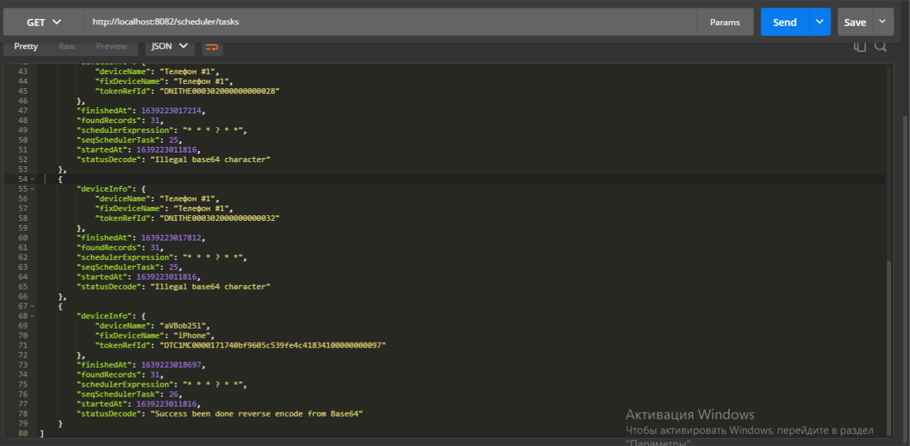

# Fix Base64 decode by scheduler task

---

FT получает из VTS поле deviceName в кодировке UTF-8 и в формате Base64

FT должен декодировать значение deviceName полученное из VTS в читабельном формат

При условии когда текст deviceName полученное из VTS уже приходит в читабельном формате - тогда FT его не декодирует...

В FT текст deviceName всегда хранится в читабельном формате


---

Какое-то время FT вообще не декодировал текст deviceName полученное из VTS...

Поэтому нужно повторить условное декодирование текста deviceName, но уже из БД FT

Условное декодирование deviceName должно выполняться:
* только в случае если текст в кодировке UTF-8 и в формате Base64
* в случае если текст в читабельном формате, тогда оставить текст как есть
* во всех остальных случаях (если текст ломаный или неизвестный формат) оставить текст как есть и вывести сообщение об ошибке


Модуль выполняющий декодирование работает аналогично стандартным инструментам и его работу можно проверить например через:  https://www.base64decode.org 


---

* 1.
  * Скрипт, который автоматизирует процесс исправления декодированного значения поля `device_name` в таблице `device_info` реализован как отдельно поставляемая утилита `fasttack-scheduler` 
  * Утилита `fasttack-scheduler.jar` поставляется в JAR-архиве
  * Запускается утилита с помощью бинарного файла `fasttack-scheduler.sh`
* 2.
  * В программе применяется шедулер, который устанавливает работу приложения в комфортный период времени.
  * Информация по настройке шедулера доступна на веб-ресурсе  https://www.freeformatter.com/cron-expression-generator-quartz.html
  * По умолчанию, настройки шедулера периодически запускают процедуру проверки записей `device_name` из таблицы `device_info` 1-раз в течении 3-секунд
  * Максимально, по умолчанию, за 1-цикл задача выполняет проверку 100-записей (или меньше - для случая если `device_info` всего меньше 100-записей)
  * В результате выполнения процедуры проверки записей `device_name` будет исправление значения в поле `device_name`
  * Утилита поддерживает 2-способа настроек:
    1. **По умолчанию** - которые сконфигурированы внутри приложения `application.conf`
    2. **Расширенные** - которые можно опционально передавать в утилиту через ее параметры запуска
       
* 3.
  * Программа хранит фокус текущей записи в таблице `device_info`.
  * Это позволяет в процессе работы программы принудительно останавливать и через некоторое время запускать снова.
  * Программа будет продолжать выполнять свою работу с последнего остановленного места.
* 4.
  * Детали по ходу работы программы можно проверить по логу `scheduler-task.log`
  * А также результаты выполнения программы можно выгрузить в JSON-формате через веб-ресурс:  ```http://<HOST>:8082/fasttack-scheduler-json/device-info-tasks```
  * Модуль выполняющий декодирование работает аналогично стандарту и его работу можно проверить, например на веб-ресурсе:  https://www.base64decode.org 
* 5.
  * Все действия, которые программа успела выполнить можно отменить.
  * Для этой цели программа создает временную таблицу `tmp_device_info`, которая дублирует записи из исходной из таблицы `device_name`, по мере выполнения проверок.
  * Временная таблица не принимает участия в FT `tmp_device_info` и поэтому ее можно удалять за не надобностью

---


---


---


Чтобы начать работу, выполните следующие действия:

1. Git-clone this repository.

        $ git clone https://github.com/ITEA-SCALA/akka-scheduler-example.git

2. Change directory into your clone:

        $ cd akka-scheduler-example

3. Launch SBT:

        $ sbt

4. Create an assembly

        > assembly

   

5. Start the application:

        > java -jar fasttack-scheduler-assembly-1.3.0-SNAPSHOT.jar --application-port 8082 --postgre-server-name localhost --postgre-database-name postgres --postgre-user postgres --postgre-password postgres --max-per-task 16 --take-num-task 5

    
    

7. Browse to http://127.0.0.1:8082/fasttack-scheduler-json/device-info-tasks

   
   

